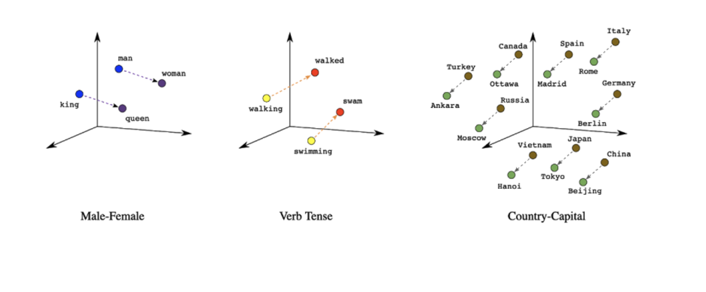
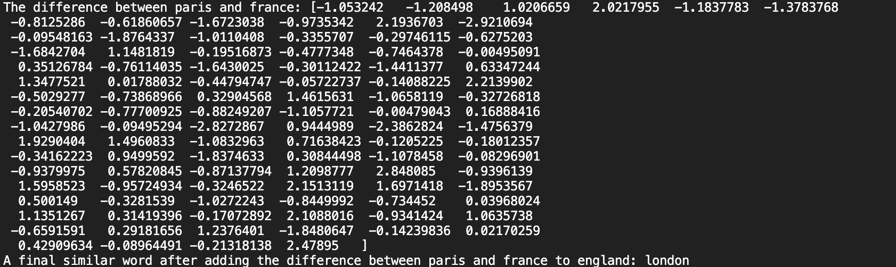
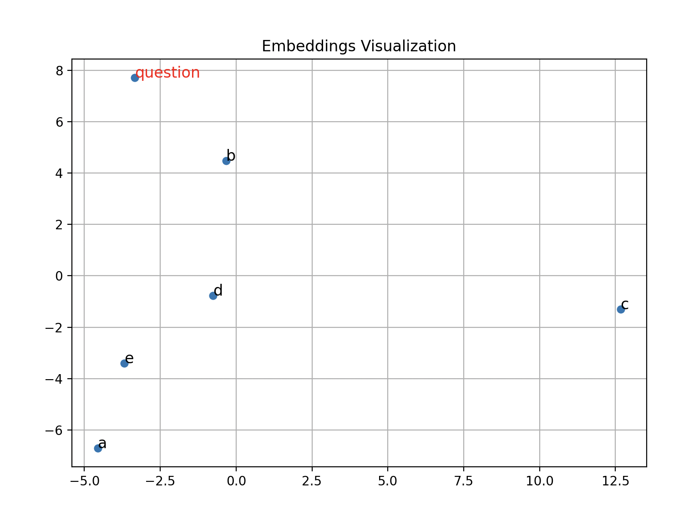

# SSAT Analogies

Solving SSAT verbal section's analogy questions using vector embedding.

---

<br />

## Background

Word2vec is a technique for natural language processing published in 2013. The word2vec algorithm uses a neural network model to learn word associations from a large corpus of text.

Gensim is a python library that implements word2vec algorithms originally developed in Google for fast training of vector embedding.

We use Gensim to train our vector embedding with a word2vec model and datasets from Wikipedia - "text 8"

<br />

## Setting Up

The first step is to install Gensim using pip (and all of its dependencies, which will also be installed automatically)

```
pip install Gensim
```

Next we will load the text8 corpus to begin our trainning

```
import gensim
import gensim.downloader as api

corpus = api.load('text8')
```

Problems arise from these lines of code, solutions are at the end of the document

Start training with text8 corpus

```
from gensim.models.word2vec import Word2Vec
model = Word2Vec(corpus)
```

Go ahead and save the model so that you don't have to retrain everytime running the script.

```
model.save("trainedModel.bin")
```

Load it later with

```
model = Word2Vec.load("trained_word2vec_model.bin")
```

Test it with something like

```
print(model.wv.most_similar('dog'))
```

Output:

[('cat', 0.836550772190094), ('hound', 0.7825815081596375), ('pig', 0.7662081718444824), ('ass', 0.7483778595924377), ('cow', 0.7459826469421387), ('goat', 0.7381320595741272), ('dogs', 0.7354974746704102), ('bird', 0.7333177328109741), ('panda', 0.7282117009162903), ('pie', 0.72819584608078)]

<br />

## Finding Distance Between Words

_"In machine learning, an embedding is a way of representing data as points in n-dimensional space so that similar data points cluster together." _

Since we trainned our embeddings based on Wikipedia billions of characters(text8 dataset), words with similar semantics or context(usually appear around one another) will be clustered in space.

<br />



<br />

Testing it on some words shows that words have more connection result in a higher similarity than words that have less connection. Such similarty distance is calculated through cosine similarty.

```
print(
    f"Similarity between france and spain: {model.wv.similarity('france', 'spain')}")
print(
    f"Similarity between bsketball and pluto: {model.wv.similarity('basketball', 'pluto')}")
```

Similarity between france and spain: 0.8095079660415649

Similarity between bsketball and pluto: 0.07107406854629517

<br />

## Difference Between Two Vectors

Instead of simply finding the distance between two vectors, we could also find the difference vector between two vectors. Which help as outlining the relationship between two words:

(vector of France - vector of paris) we get the relationship between france and paris, the relationship is Paris is the capital of France. If we then add the difference vector to the vector of "England", and find the most similar word to that final vector, we can find the capital of London, as it has the same relationship to England as Paris to France.

```
paris_vector = model.wv["paris"]
france_vector = model.wv["france"]
england_vector = model.wv["england"]

difference_vector = paris_vector - france_vector
print("The difference between paris and france: " + str(difference_vector))

final_vector = england_vector + difference_vector
final_word, sim = model.wv.similar_by_vector(final_vector, topn=2)[1]

print("A final similar word after adding the difference between paris and france to england: " + final_word)
```

A final similar word after adding the difference between paris and france to england: london



\*\*Note that these vectori manipulations depends largely on the datasets we trained on, since the text8 is a dataset from 2006, it will be unlikely if we input some more modern contexted words to the model.

For example, subtracting Durant from basketball and adding on to soccer vector should probably result in the name of some star soccer player, however, Kevin Durant was not yet in the league in 2006, so the results would likely not be as expected

<br />

## Solving the SSAT Analogy Problems

Given the fact that we could subtract word vectors and find the difference vector between them, we could apply this to analogy problems.

We can subtract word A from word B in each of the options, and comparing the difference vector to the difference vector of the question, and choose the closest one.

Flake is to snow as (The answer is B. A flake is a small unit of snow, just as a drop is a small unit of rain.)

(A) storm is to hail
(B) drop is to rain
(C) field is to wheat
(D) stack is to hay
(E) cloud is to fog

Gensim does not provide function for cosine similarity between two vectors that does not have a word associated with so we will have to write our own function first.

```
def cosine_similarity(vector1, vector2):
  # Calculate the cosine distance between the two vectors using NumPy
  return np.dot(vector1, vector2) / (np.linalg.norm(vector1) * np.linalg.norm(vector2))
```

Then, we subtract the difference vector between word A and B in the quesiton and all the answer options for comparison.

```
model = Word2Vec.load("trainedModel.bin")

question = model.wv["flake"] - model.wv["snow"]
a = model.wv["storm"] - model.wv["hail"]
b = model.wv["drop"] - model.wv["rain"]
c = model.wv["field"] - model.wv["wheat"]
d = model.wv["stack"] - model.wv["hay"]
e = model.wv["cloud"] - model.wv["fog"]

print("Cosine Similarities: ")
print("Option A " + str(cosine_similarity(a, question)))
print("Option B " + str(cosine_similarity(b, question)))
print("Option C " + str(cosine_similarity(c, question)))
print("Option D " + str(cosine_similarity(d, question)))
print("Option E " + str(cosine_similarity(e, question)))
```

Printing out the results shows that option B have the highest similarity to our question difference vector, thus giving us the correct answer.

Cosine Similarities:

Option A -0.5162843

**Option B 0.5129441**

Option C 0.111720726

Option D 0.1051023

Option E -0.29211172

<br />

## Visualizing Solutions

Using Sci-kit Learn's principle component analysis(PCA), we can flatten the word vector space to 2D space, which can then be visualized using Matplotlib

```
import numpy as np
from gensim.models import Word2Vec
from sklearn.decomposition import PCA
import matplotlib.pyplot as plt

# Replace with the path to your trained model file
model = Word2Vec.load("trainedModel.bin")

question = model.wv["flake"] - model.wv["snow"]
a = model.wv["storm"] - model.wv["hail"]
b = model.wv["drop"] - model.wv["rain"]
c = model.wv["field"] - model.wv["wheat"]
d = model.wv["stack"] - model.wv["hay"]
e = model.wv["cloud"] - model.wv["fog"]
vectors = [question, a, b, c, d, e]

# Apply PCA to reduce the word vectors to 2 dimensions
pca = PCA(n_components=2)
vectors_2d = pca.fit_transform(vectors)

# Plot the 2D word vectors using Matplotlib
plt.figure(figsize=(10, 8))
plt.scatter(vectors_2d[:, 0], vectors_2d[:, 1], marker='o', s=30)

# Annotate the points with the labels 'question', 'a' to 'e'
labels = ['question', 'a', 'b', 'c', 'd', 'e']
for i, label in enumerate(labels):
    if label == 'question':
        plt.annotate(label, xy=(
            vectors_2d[i, 0], vectors_2d[i, 1]), fontsize=12, color='red')
    else:
        plt.annotate(label, xy=(
            vectors_2d[i, 0], vectors_2d[i, 1]), fontsize=12)

plt.title('Embeddings Visualization')
plt.grid(True)
plt.show()
```



It can be observed that the vector b is a lot closer to our difference vector presented in the question, showing a better similarity between the wordA and B in comparison to the question than the rest of the options.

<br />

## Testing Solutions:

<br />

## Common Problem 1:

These problems were common when first setting up Gensim and executing the code above:

ssl.SSLCertVerificationError: [SSL: CERTIFICATE_VERIFY_FAILED] certificate verify failed: unable to get local issuer certificate (\_ssl.c:997

FileNotFoundError: [Errno 2] No such file or directory: ---

ValueError: unable to read local cache during fallback, connect to the Internet and retry

All need to be done is to create the unfound file under your **/Users/<username>/Gensim-data** directory and input it with the lines in [list.json](https://github.com/RaRe-Technologies/gensim-data/blob/master/list.json) found on the Github Repo.

```
vim /Users/<username>/Gensim-data/information.json
```

After creating and filling in information.json, a certVerification error commonly arise.

ssl.SSLCertVerificationError: [SSL: CERTIFICATE_VERIFY_FAILED] certificate verify failed: unable to get local issuer certificate (\_ssl.c:997

Solve it with

```
bash /Applications/Python*/Install\ Certificates.command
```
